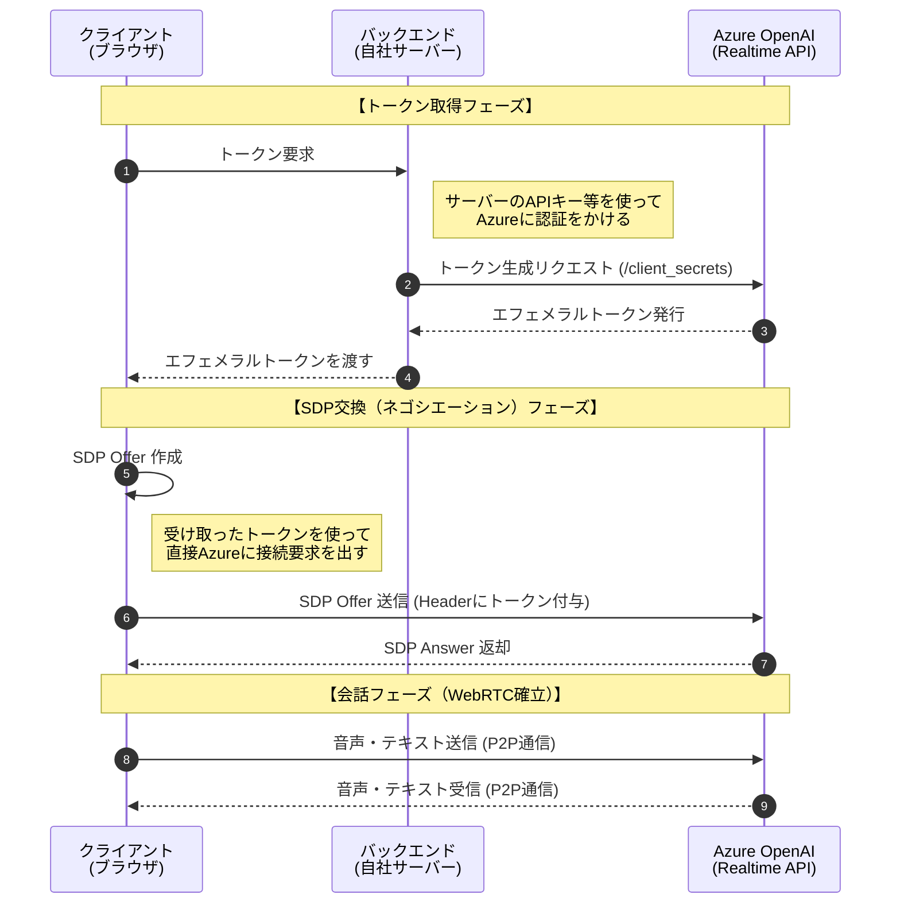
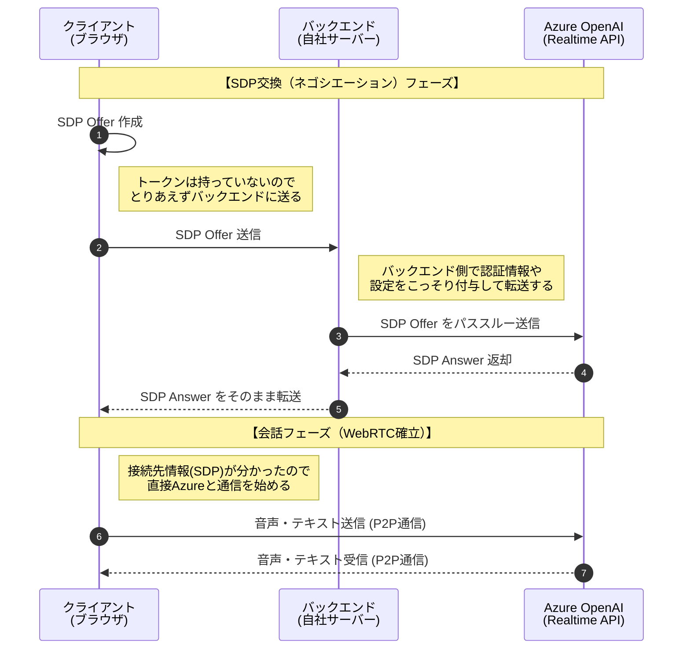

申し訳ありません！完全に私のミスです。

ご提示いただいたエラー画像にある通り、Mermaidのシーケンス図において双方向を示すつもりで書いた `<-->>` という矢印の構文が、標準的なパーサーで「無効な形式（INVALID）」として弾かれてしまっています。

安全で確実な標準構文（`->>` と `-->>`）を使って、双方向のやり取りを表現するように修正しました。こちらで問題なくレンダリングされるはずです！

### 1. エフェメラルトークン方式（修正版）

---

### 2. SDPパススルー方式（修正版）

お手数をおかけしました！プレビュー環境やドキュメントツールなどで、こちらのコードをコピペして再度お試しいただけますでしょうか？
